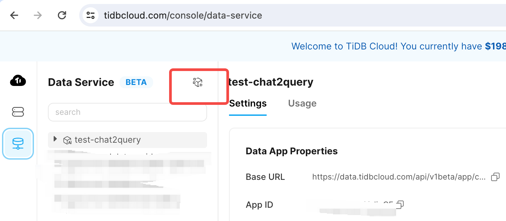
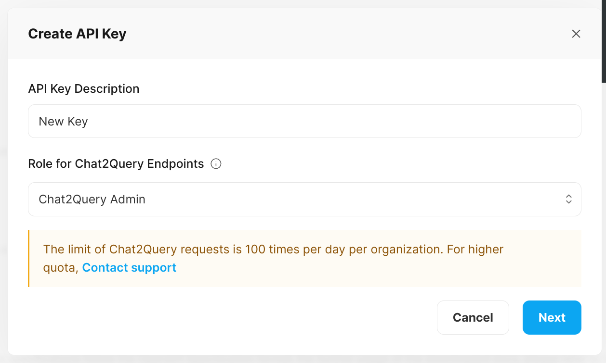

# Bird for Chat2Query

Dev dataset score is 58.15.

Below are the steps to run bird evaluation

## Step 1: Create a new Chat2Query App in TiDBCloud

You have to login in [TiDBCloud](https://tidbcloud.com), and create a Chat2Query DataApp.





Save the Base URL, we'll use it in step 5.

## Step 2: Create Chat2Query API Key



Save the public key and private key, we'll use it in step 5.

## Step 3: Clone the repository and install dependencies

```bash
$ git clone https://github.com/tidbcloud/chat2query_bench
$ cd chat2query_bench/benchmark_bird
$ pip install -r requirements.txt
```

Download the bird dataset: https://bird-bench.oss-cn-beijing.aliyuncs.com/dev.zip
unzip it in the `benchmark_bird/data` folder, and make sure the folder name is `data`, not `dev`.

File structures should like:

```bash
$ tree -L 1 data/
data/
├── dev_databases
├── dev_gold.sql
└── dev.json

2 directories, 2 files
```

## Step 4: Edit the `runbird.sh` script

Replace or paste the BASE_URL, PUBLIC_KEY, PRIVATE_KEY variables in `runbird.sh`

## Step 5: Run the script to generate sql and run evaluation

```bash
$./runbird.sh
```
